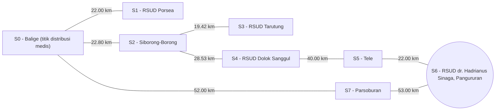

# SmartCare Logistics: Optimasi Rute Distribusi Obat dan Darah Darurat di Wilayah Toba dan Sekitarnya Menggunakan Algoritma A dan Uniform Cost Search (UCS)*

Sistem purwarupa pencarian ruang keadaan (*State-Space Search*) berbasis **Uniform Cost Search (UCS)** dan **A* Search** untuk penentuan rute distribusi medis paling optimal di wilayah Toba dan sekitarnya.

---

## 👥 Anggota Kelompok & Pembagian Peran

* **Kelompok**: 06
* **Program Studi**: Sarjana Sistem Informasi, Institut Teknologi Del (T.A. 2026/2027)
* **Anggota Tim**:
  * **Kelvin Yohanes Putra Marpaung (12S24018)** - *AI Architect & Model Lead*
  * **Amelia Renata Lumbanbatu (12S24031)** - *Data & Knowledge Engineer*
  * **Nikah Suchia Panjaitan (12S24041)** - *QA, Evaluation & Ethics Lead*

---

## 📌 Problem Framing & Bisnis (Wilayah Toba)

* **Domain Bisnis**: Logistik Rantai Pasok Kesehatan Enterprise (*Time-Critical Medical Supply Chain Logistics*).
* **Profil Permasalahan**: Pemindahan obat-obatan esensial dan stok kantong darah darurat dari titik distribusi medis sentral (**S0 - Balige (titik distribusi medis)**) menuju berbagai fasilitas kesehatan tujuan di wilayah Toba.
* **Pain Points Utama**:
  1. **Banyaknya Alternatif Rute**: Jaringan perjalanan yang menghubungkan antar-fasilitas kesehatan memiliki beberapa opsi rute cabang.
  2. **Pemilihan Rute Manual**: Pemilihan jalur secara manual rawan menghasilkan rute sub-optimal dengan akumulasi jarak yang lebih panjang.
  3. **Keputusan Berbasis Biaya Jarak**: Jumlah perpindahan (*hop*) yang lebih sedikit belum tentu menghasilkan total jarak perjalanan terpendek dalam kilometer.
* **Justifikasi Solusi AI**: Penggunaan *State-Space Search* (UCS & A* Search) memungkinkan kalkulasi rute distribusi terpendek secara terstruktur, presisi, dan deterministik pada graf berbobot jarak real-life.

---

## 🎯 Spesifikasi Formal PEAS

* **Performance Measure**: Minimasi total jarak perjalanan (km), keberhasilan mencapai *goal state*, optimalitas solusi (*minimum path cost*), dan efisiensi pencarian (jumlah *state* dieksplorasi).
* **Environment**: Jaringan rute distribusi medis di wilayah Toba dan sekitarnya (graf berbobot jarak dalam kilometer).
* **Actuators**: Pemilihan *state* tujuan berikutnya, penentuan jalur distribusi, dan penyajian rekomendasi rute pada sistem pendukung keputusan.
* **Sensors**: Data lokasi (*state*), data konektivitas graf (*edges*), data bobot jarak (km), *initial state*, dan *goal state*.

### Karakteristik Lingkungan Operasional (6 Dimensi)

| Karakteristik | Klasifikasi | Penjelasan pada Proyek |
|---|---|---|
| **Observability** | *Partially Observable* | Informasi operasional dunia nyata tidak diperoleh secara sempurna. Model *baseline* menggunakan jaringan graf dan bobot jarak yang tersedia. |
| **Determinism** | *Stochastic* (Dunia Nyata) | Perjalanan dunia nyata dipengaruhi faktor dinamis. Model *baseline* menggunakan bobot tetap agar eksperimen terkontrol. |
| **Episodic / Sequential** | *Sequential* | Keputusan pada suatu *state* menentukan *state* berikutnya dan memengaruhi akumulasi total jarak. |
| **Static / Dynamic** | *Dynamic* (Dunia Nyata) | Kondisi lalu lintas jalan nyata dapat berubah. Graf *baseline* diset konstan untuk pembandingan UCS dan A*. |
| **Discrete / Continuous** | *Discrete* | Lokasi dan koneksi perjalanan direpresentasikan sebagai *nodes* dan *edges* diskrit pada graf. |
| **Single-Agent / Multi-Agent**| *Single-Agent* | Agen berfokus penuh pada keputusan rutenya sendiri tanpa pemodelan kompetisi agen lain. |

---

## 🧮 Formulasi Ruang Keadaan Matematika $(X, A, T, G, C)$

* **State Space ($X$) & Nama Lokasi Lengkap**:
  * `S0`: **S0 - Balige (titik distribusi medis)** *(Initial State)*
  * `S1`: **S1 - RSUD Porsea**
  * `S2`: **S2 - Siborong-Borong**
  * `S3`: **S3 - RSUD Tarutung**
  * `S4`: **S4 - RSUD Dolok Sanggul**
  * `S5`: **S5 - Tele**
  * `S6`: **S6 - RSUD dr. Hadrianus Sinaga, Pangururan** *(Goal State Utama)*
  * `S7`: **S7 - Parsoburan**
* **Actions ($A$)**: Opsi perpindahan menuju *state* tetangga yang terhubung langsung pada graf.
* **Transition Model ($T$)**: $T(s, a) = s'$ sesuai konektivitas graf (*undirected graph*).
* **Goal Test ($G$)**: Agen mencapai *state* tujuan yang ditentukan, contoh skenario utama: $G(s) = (s == \text{S6})$.
* **Path Cost ($C$)**: Akumulasi total jarak perjalanan dalam kilometer: $C(P) = \sum_{i=0}^{n-1} c(s_i, s_{i+1})$.

### 📊 Visualisasi Graf Ruang Keadaan dengan Nama Lokasi Lengkap



---

## 🧠 Pembuktian & Verifikasi Heuristik Admissible $h(n)$

Fungsi heuristik A* dirumuskan secara matematis:
$$h(n) = d_{\text{hop}}(n, G) \times c_{\text{min}}$$

Di mana:
* $d_{\text{hop}}(n, G)$ = Jumlah *edge* (hop) minimum dari node $n$ menuju goal $G$.
* $c_{\text{min}} = 19.42\text{ km}$ (bobot *edge* terkecil pada seluruh graf, yaitu hubungan `S2` - `S3`).

### Tabel Nilai Heuristik untuk Goal `S6` (Pangururan)

| Kode State | Nama Lokasi Lengkap | Min Hop ke `S6` | Nilai $h(n)$ (km) | Biaya Aktual $h^*(n)$ | Status Admissible |
|---|---|:---:|:---:|:---:|:---:|
| `S0` | **S0 - Balige (titik distribusi medis)** | 2 | 38.84 km | 105.00 km | ✅ $38.84 \le 105.00$ |
| `S1` | **S1 - RSUD Porsea** | 3 | 58.26 km | 127.00 km | ✅ $58.26 \le 127.00$ |
| `S2` | **S2 - Siborong-Borong** | 3 | 58.26 km | 90.53 km | ✅ $58.26 \le 90.53$ |
| `S3` | **S3 - RSUD Tarutung** | 4 | 77.68 km | 109.95 km | ✅ $77.68 \le 109.95$ |
| `S4` | **S4 - RSUD Dolok Sanggul** | 2 | 38.84 km | 62.00 km | ✅ $38.84 \le 62.00$ |
| `S5` | **S5 - Tele** | 1 | 19.42 km | 22.00 km | ✅ $19.42 \le 22.00$ |
| `S6` | **S6 - RSUD dr. Hadrianus Sinaga, Pangururan** | 0 | 0.00 km | 0.00 km | ✅ $0.00 \le 0.00$ |
| `S7` | **S7 - Parsoburan** | 1 | 19.42 km | 53.00 km | ✅ $19.42 \le 53.00$ |

---

## 📈 Hasil Eksperimen & Perbandingan Algoritma

Berdasarkan eksekusi eksperimen pada graf ruang keadaan wilayah Toba, diperoleh hasil rute lengkap sebagai berikut:

| Skenario Pengujian | Algoritma | Rute Lengkap yang Ditemukan | Total Cost (km) | State Dieksplorasi | Status |
|---|---|---|:---:|:---:|:---:|
| **S0 $\rightarrow$ S6** (Balige - Pangururan) | **UCS** | `S0 - Balige (titik distribusi medis)` $\rightarrow$ `S7 - Parsoburan` $\rightarrow$ `S6 - RSUD dr. Hadrianus Sinaga, Pangururan` | **105.00 km** | 8 state | Berhasil |
| **S0 $\rightarrow$ S6** (Balige - Pangururan) | **A\*** | `S0 - Balige (titik distribusi medis)` $\rightarrow$ `S7 - Parsoburan` $\rightarrow$ `S6 - RSUD dr. Hadrianus Sinaga, Pangururan` | **105.00 km** | **6 state** | Berhasil |
| **S0 $\rightarrow$ S3** (Balige - Tarutung) | **UCS** | `S0 - Balige (titik distribusi medis)` $\rightarrow$ `S2 - Siborong-Borong` $\rightarrow$ `S3 - RSUD Tarutung` | **42.22 km** | 4 state | Berhasil |
| **S0 $\rightarrow$ S3** (Balige - Tarutung) | **A\*** | `S0 - Balige (titik distribusi medis)` $\rightarrow$ `S2 - Siborong-Borong` $\rightarrow$ `S3 - RSUD Tarutung` | **42.22 km** | **3 state** | Berhasil |
| **S0 $\rightarrow$ S4** (Balige - Dolok Sanggul) | **UCS** | `S0 - Balige (titik distribusi medis)` $\rightarrow$ `S2 - Siborong-Borong` $\rightarrow$ `S4 - RSUD Dolok Sanggul` | **51.33 km** | 5 state | Berhasil |
| **S0 $\rightarrow$ S4** (Balige - Dolok Sanggul) | **A\*** | `S0 - Balige (titik distribusi medis)` $\rightarrow$ `S2 - Siborong-Borong` $\rightarrow$ `S4 - RSUD Dolok Sanggul` | **51.33 km** | **3 state** | Berhasil |

### 💡 Analisis Temuan Eksperimen
1. **Optimalitas Rute**: Kedua algoritma (UCS dan A*) menghasilkan rute dengan *Path Cost* (total jarak) yang identik pada seluruh skenario.
2. **Efisiensi Pencarian**: A* Search mengeksplorasi *state* lebih sedikit dibanding UCS (contoh Skenario Utama: **6 state vs 8 state**), membuktikan efektivitas arahan fungsi heuristik $h(n)$.

---

## 📁 Struktur Repositori

```text
SmartCare-Logistics/
├── .venv/                  # Virtual Environment (Managed by Astral uv)
├── src/
│   ├── smartcare_logistics/
│   │   ├── __init__.py
│   │   └── search.py       # Algoritma UCS, A*, & Nama Lokasi Lengkap S0-S7 (heapq)
│   └── main.py             # Skrip simulasi utama & cetak rute nama lokasi lengkap
├── tests/
│   └── test_search.py      # Pengujian otomatis unit test (pytest)
├── .gitignore
├── .python-version
├── LICENSE                 # Lisensi MIT
├── pyproject.toml          # Dependensi Astral uv
├── README.md               # Dokumentasi Laporan Milestone 1 dengan Nama Tempat Lengkap
└── uv.lock
```

---

## 🚀 Instruksi Eksekusi

1. **Sinkronkan Environment & Dependensi (Astral `uv`)**:
   ```powershell
   uv sync
   ```

2. **Menjalankan Simulasi (Eksperimen Rute UCS vs A*)**:
   ```powershell
   uv run python src/main.py
   ```

3. **Menjalankan Pengujian Otomatis (Pytest)**:
   ```powershell
   uv run pytest
   ```
