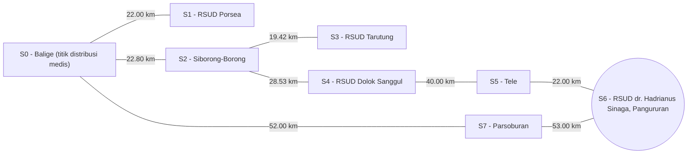

# SmartCare Logistics: Enterprise AI Copilot Optimasi Rute & Alokasi Armada Medis

Sistem purwarupa berbasis **State-Space Search (UCS & A* Search)** dan **Constraint Satisfaction Problems (CSP Solver dengan AC-3 & Backtracking MRV/LCV/FC)** untuk optimasi perutean serta alokasi kendaraan medis darurat di wilayah Toba dan sekitarnya.

---

## 👥 Anggota Kelompok & Pembagian Peran

* **Kelompok**: 06
* **Program Studi**: Sarjana Sistem Informasi, Institut Teknologi Del (T.A. 2026/2027)
* **Anggota Tim**:
  * **Kelvin Yohanes Putra Marpaung (12S24018)** - *AI Architect & Model Lead*
  * **Amelia Renata Lumbanbatu (12S24031)** - *Data & Knowledge Engineer*
  * **Nikah Suchia Panjaitan (12S24041)** - *QA, Evaluation & Ethics Lead*

---

## 📍 MILESTONE 1: STATE-SPACE SEARCH (UCS & A*)

### 📌 Problem Framing & Bisnis (Wilayah Toba)

* **Domain Bisnis**: Logistik Rantai Pasok Kesehatan Enterprise (*Time-Critical Medical Supply Chain Logistics*).
* **Profil Permasalahan**: Pemindahan obat-obatan esensial dan stok kantong darah darurat dari titik distribusi medis sentral (**S0 - Balige (titik distribusi medis)**) menuju berbagai fasilitas kesehatan tujuan di wilayah Toba.
* **Justifikasi Solusi AI**: *State-Space Search* (UCS & A* Search) memungkinkan kalkulasi rute distribusi terpendek secara terstruktur dan deterministik pada graf berbobot jarak real-life.

### 🎯 Spesifikasi Formal PEAS

* **Performance Measure**: Minimasi total jarak perjalanan (km), keberhasilan mencapai *goal state*, optimalitas solusi (*minimum path cost*), dan efisiensi pencarian (jumlah *state* dieksplorasi).
* **Environment**: Jaringan rute distribusi medis di wilayah Toba (graf berbobot jarak dalam kilometer).
* **Actuators**: Pemilihan *state* tujuan berikutnya, penentuan jalur distribusi, dan penyajian rekomendasi rute.
* **Sensors**: Data lokasi (*state*), data konektivitas graf (*edges*), data bobot jarak (km), *initial state*, dan *goal state*.

### 🧮 Formulasi Ruang Keadaan Matematika (X, A, T, G, C)

* **State Space (X)**:
  * `S0`: **S0 - Balige (titik distribusi medis)** *(Initial State)*
  * `S1`: **S1 - RSUD Porsea**
  * `S2`: **S2 - Siborong-Borong**
  * `S3`: **S3 - RSUD Tarutung**
  * `S4`: **S4 - RSUD Dolok Sanggul**
  * `S5`: **S5 - Tele**
  * `S6`: **S6 - RSUD dr. Hadrianus Sinaga, Pangururan** *(Goal State Utama)*
  * `S7`: **S7 - Parsoburan**

### 📊 Visualisasi Graf Ruang Keadaan



---

## 🧩 MILESTONE 2: CONSTRAINT SATISFACTION PROBLEMS (CSP)

### 📌 Problem Framing Sub-Masalah Bisnis Milestone 2
* **Kasus Keputusan Bisnis**: **Alokasi Armada Kendaraan Medis & Ambulans Logistik Cold-Chain** (*Medical Cold-Chain Vehicle & Fleet Assignment Problem*).
* **Latar Belakang Operasional**: Penugasan armada ambulans dan kendaraan pendukung distribusi obat/darah darurat ke fasilitas kesehatan tujuan harus memenuhi batasan operasional, yaitu tidak boleh ada penugasan ganda pada armada yang sama dan terdapat pembatasan penggunaan kendaraan tertentu pada fasilitas yang memerlukan armada khusus.

### 📐 Pemodelan Matematis Formal Tiga Serangkai <X, D, C>

1. **Himpunan Variabel (X)**:

   Fasilitas kesehatan tujuan penerima pasokan medis darurat:

   `X = {S1_RSUD_Porsea, S3_RSUD_Tarutung, S4_RSUD_DolokSanggul, S6_RSUD_Pangururan}`

2. **Himpunan Domain (D)**:

   Opsi armada kendaraan medis yang tersedia pada pusat distribusi Balige:

   `D = {Ambulance_01 (ColdChain), Ambulance_02 (General), ColdChain_Van_A (DeepFreezer), ColdChain_Van_B (Standard)}`

3. **Himpunan Batasan (C)**:

   - **Unary Constraint (Arity 1)**:

     `S6_RSUD_Pangururan ≠ Ambulance_02 (General)`

     *(Armada `Ambulance_02 (General)` tidak diperbolehkan untuk fasilitas Pangururan berdasarkan restriction yang digunakan dalam model CSP.)*

   - **Binary Constraint (Arity 2)**:

     `vehicle(Xi) ≠ vehicle(Xj), untuk setiap i ≠ j`

     *(Setiap armada kendaraan hanya dapat dialokasikan ke satu fasilitas kesehatan pada satu sesi pengiriman.)*

### 🛠️ Arsitektur Mesin Inferensi Batasan (*Constraint Solver*)

Modul Python [`solver.py`](file:///d:/Smartcare-Logistics/src/smartcare_logistics/solver.py) mengimplementasikan:
1. **Arc Consistency 3 (AC-3)** (Mackworth, 1977): Melakukan pemangkasan nilai domain yang inkonsisten secara logis sebelum dan selama pencarian dengan prosedur `Revise(Xi, Xj)`.
2. **Backtracking Search**: Rekursi pencarian terstruktur yang diakselerasi oleh:
   * **MRV (Minimum Remaining Values)**: Memilih variabel berikutnya dengan sisa nilai domain paling sedikit (*Fail-First Principle*).
   * **LCV (Least Constraining Value)**: Memilih urutan nilai domain yang paling sedikit membatasi variabel tetangga (*Fail-Last Principle*).
   * **Forward Checking (FC)**: Melakukan propagasi langsung setiap kali variabel diberi nilai untuk mencegah eksplorasi cabang buntu.

---

## 📈 HASIL EKSPERIMEN & ANALISIS SENSITIVITAS

### 1. Hasil Pencarian Rute Milestone 1 (UCS vs A*)

| Skenario Pengujian | Algoritma | Rute Lengkap yang Ditemukan | Total Cost (km) | State Dieksplorasi | Status |
|---|---|---|:---:|:---:|:---:|
| **S0 → S6** | **UCS** | `S0 - Balige` → `S7 - Parsoburan` → `S6 - Pangururan` | **105.00 km** | 8 state | Berhasil |
| **S0 → S6** | **A\*** | `S0 - Balige` → `S7 - Parsoburan` → `S6 - Pangururan` | **105.00 km** | **6 state** | Berhasil |
| **S0 → S3** | **UCS** | `S0 - Balige` → `S2 - Siborong-Borong` → `S3 - Tarutung` | **42.22 km** | 4 state | Berhasil |
| **S0 → S3** | **A\*** | `S0 - Balige` → `S2 - Siborong-Borong` → `S3 - Tarutung` | **42.22 km** | **3 state** | Berhasil |
| **S0 → S4** | **UCS** | `S0 - Balige` → `S2 - Siborong-Borong` → `S4 - Dolok Sanggul` | **51.33 km** | 5 state | Berhasil |
| **S0 → S4** | **A\*** | `S0 - Balige` → `S2 - Siborong-Borong` → `S4 - Dolok Sanggul` | **51.33 km** | **3 state** | Berhasil |

### 2. Hasil Eksekusi & Analisis Sensitivitas CSP Milestone 2

| Kasus Uji Sensitivitas | Deskripsi Masalah | Status Solusi | Node Ekspansi | Waktu Eksekusi (ms) |
|---|---|:---:|:---:|:---:|
| **Skala Kecil** | 3 RSUD, 4 Armada Kendaraan | **SOLUSI VALID** | 4 node | 0.73 ms |
| **Skala Besar** | 7 RSUD, 8 Armada Kendaraan | **SOLUSI VALID** | 8 node | 4.13 ms |
| **Kasus Ekstrem (Overconstrained)** | 4 RSUD, 2 Armada Kendaraan (Defisit Armada) | **TIDAK ADA SOLUSI** | 3 node | 0.64 ms |

---

## 📁 Struktur Repositori

```text
SmartCare-Logistics/
├── .venv/                  # Virtual Environment (Managed by Astral uv)
├── src/
│   ├── smartcare_logistics/
│   │   ├── __init__.py
│   │   ├── search.py        # Algoritma UCS, A*, dan heuristik
│   │   └── solver.py        # Mesin Inferensi CSP (AC-3, Backtracking MRV/LCV/FC)
│   └── main.py              # Skrip simulasi utama Milestone 1 & Milestone 2
├── tests/
│   ├── test_search.py       # Pengujian otomatis State-Space Search (pytest)
│   └── test_solver.py       # Pengujian otomatis CSP Solver (pytest)
├── .gitignore
├── .python-version
├── LICENSE                 # Lisensi MIT
├── pyproject.toml          # Dependensi Astral uv
├── README.md               # Dokumentasi Laporan Milestone 1 & 2
└── uv.lock
```

---

## 🚀 Instruksi Eksekusi

1. **Sinkronkan Environment & Dependensi (Astral `uv`)**:
   ```powershell
   uv sync
   ```

2. **Menjalankan Simulasi Utama (Milestone 1 & Milestone 2)**:
   ```powershell
   uv run python src/main.py
   ```

3. **Menjalankan Seluruh Pengujian Otomatis (Pytest)**:
   ```powershell
   uv run pytest
   ```
