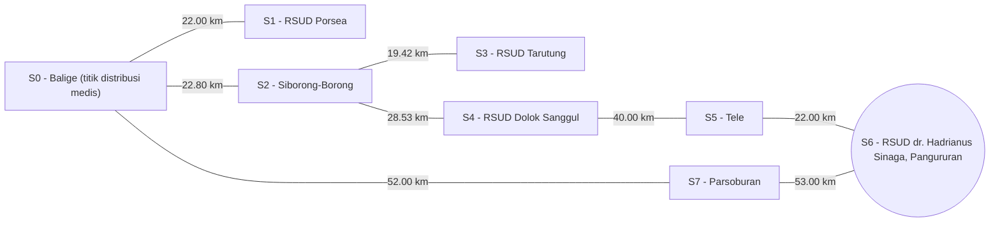

# Optimasi Rute Distribusi Obat dan Darah Darurat di Wilayah Toba dan Sekitarnya Menggunakan Algoritma A dan Uniform Cost Search (UCS)*

Sistem purwarupa berbasis **State-Space Search (UCS & A* Search)** dan **Constraint Satisfaction Problems (CSP Solver dengan AC-3 & Backtracking MRV/LCV/FC)** untuk optimasi perutean serta alokasi kendaraan medis darurat di wilayah Toba dan sekitarnya.

---

## 👥 Anggota Kelompok & Pembagian Peran

* **Kelompok**: 06
* **Program Studi**: Sarjana Sistem Informasi, Institut Teknologi Del (T.A. 2026/2027)
* **Anggota Tim**:
  * **Kelvin Yohanes Putra Marpaung (12S24018)** - *AI Architect & Model Lead*
  * **Amelia Renata Lumbanbatu (12S24031)** - *Data & Knowledge Engineer*
  * **Nikah Suchia Panjaitan (12S24041)** - *QA, Evaluation & Ethics Lead*

---

## 📍 MILESTONE 1: STATE-SPACE SEARCH (UCS & A*)

### 📌 Problem Framing & Bisnis (Wilayah Toba)

* **Domain Bisnis**: Logistik Rantai Pasok Kesehatan Enterprise (*Time-Critical Medical Supply Chain Logistics*).
* **Profil Permasalahan**: Pemindahan obat-obatan esensial dan stok kantong darah darurat dari titik distribusi medis sentral (**S0 - Balige (titik distribusi medis)**) menuju berbagai fasilitas kesehatan tujuan di wilayah Toba.
* **Justifikasi Solusi AI**: *State-Space Search* (UCS & A* Search) memungkinkan kalkulasi rute distribusi terpendek secara terstruktur dan deterministik pada graf berbobot jarak real-life.

### 🎯 Spesifikasi Formal PEAS

* **Performance Measure**: Minimasi total jarak perjalanan (km), keberhasilan mencapai *goal state*, optimalitas solusi (*minimum path cost*), dan efisiensi pencarian (jumlah *state* dieksplorasi).
* **Environment**: Jaringan rute distribusi medis di wilayah Toba (graf berbobot jarak dalam kilometer).
* **Actuators**: Pemilihan *state* tujuan berikutnya, penentuan jalur distribusi, dan penyajian rekomendasi rute.
* **Sensors**: Data lokasi (*state*), data konektivitas graf (*edges*), data bobot jarak (km), *initial state*, dan *goal state*.

### 🧮 Formulasi Ruang Keadaan Matematika (X, A, T, G, C)

* **State Space (X)**:
  * `S0`: **S0 - Balige (titik distribusi medis)** *(Initial State)*
  * `S1`: **S1 - RSUD Porsea**
  * `S2`: **S2 - Siborong-Borong**
  * `S3`: **S3 - RSUD Tarutung**
  * `S4`: **S4 - RSUD Dolok Sanggul**
  * `S5`: **S5 - Tele**
  * `S6`: **S6 - RSUD dr. Hadrianus Sinaga, Pangururan** *(Goal State Utama)*
  * `S7`: **S7 - Parsoburan**

### 📊 Visualisasi Graf Ruang Keadaan



---

## 🧩 MILESTONE 2: CONSTRAINT SATISFACTION PROBLEMS (CSP)

### 📌 Problem Framing Sub-Masalah Bisnis Milestone 2
* **Kasus Keputusan Bisnis**: **Alokasi Armada Kendaraan Medis & Ambulans Logistik Cold-Chain** (*Medical Cold-Chain Vehicle & Fleet Assignment Problem*).
* **Latar Belakang Operasional**: Penugasan armada ambulans dan kendaraan pendukung distribusi obat/darah darurat ke fasilitas kesehatan tujuan harus memenuhi batasan operasional, yaitu tidak boleh ada penugasan ganda pada armada yang sama dan terdapat pembatasan penggunaan kendaraan tertentu pada fasilitas yang memerlukan armada khusus.

### 📐 Pemodelan Matematis Formal Tiga Serangkai <X, D, C>

1. **Himpunan Variabel (X)**:

   Fasilitas kesehatan tujuan penerima pasokan medis darurat:

   `X = {S1_RSUD_Porsea, S3_RSUD_Tarutung, S4_RSUD_DolokSanggul, S6_RSUD_Pangururan}`

2. **Himpunan Domain (D)**:

   Opsi armada kendaraan medis yang tersedia pada pusat distribusi Balige:

   `D = {Ambulance_01 (ColdChain), Ambulance_02 (General), ColdChain_Van_A (DeepFreezer), ColdChain_Van_B (Standard)}`

3. **Himpunan Batasan (C)**:

   - **Unary Constraint (Arity 1)**:

     `S6_RSUD_Pangururan ≠ Ambulance_02 (General)`

     *(Armada `Ambulance_02 (General)` tidak diperbolehkan untuk fasilitas Pangururan berdasarkan restriction yang digunakan dalam model CSP.)*

   - **Binary Constraint (Arity 2)**:

     `vehicle(Xi) ≠ vehicle(Xj), untuk setiap i ≠ j`

     *(Setiap armada kendaraan hanya dapat dialokasikan ke satu fasilitas kesehatan pada satu sesi pengiriman.)*

### 🛠️ Arsitektur Mesin Inferensi Batasan (*Constraint Solver*)

Modul Python [`solver.py`](src/smartcare_logistics/solver.py) mengimplementasikan:
1. **Arc Consistency 3 (AC-3)** (Mackworth, 1977): Melakukan pemangkasan nilai domain yang inkonsisten secara logis sebelum dan selama pencarian dengan prosedur `Revise(Xi, Xj)`.
2. **Backtracking Search**: Rekursi pencarian terstruktur yang diakselerasi oleh:
   * **MRV (Minimum Remaining Values)**: Memilih variabel berikutnya dengan sisa nilai domain paling sedikit (*Fail-First Principle*).
   * **LCV (Least Constraining Value)**: Memilih urutan nilai domain yang paling sedikit membatasi variabel tetangga (*Fail-Last Principle*).
   * **Forward Checking (FC)**: Melakukan propagasi langsung setiap kali variabel diberi nilai untuk mencegah eksplorasi cabang buntu.

---

## 📈 HASIL EKSPERIMEN & ANALISIS SENSITIVITAS

### 1. Hasil Pencarian Rute Milestone 1 (UCS vs A*)

| Skenario Pengujian | Algoritma | Rute Lengkap yang Ditemukan | Total Cost (km) | State Dieksplorasi | Status |
|---|---|---|:---:|:---:|:---:|
| **S0 → S6** | **UCS** | `S0 - Balige` → `S7 - Parsoburan` → `S6 - Pangururan` | **105.00 km** | 8 state | Berhasil |
| **S0 → S6** | **A\*** | `S0 - Balige` → `S7 - Parsoburan` → `S6 - Pangururan` | **105.00 km** | **6 state** | Berhasil |
| **S0 → S3** | **UCS** | `S0 - Balige` → `S2 - Siborong-Borong` → `S3 - Tarutung` | **42.22 km** | 4 state | Berhasil |
| **S0 → S3** | **A\*** | `S0 - Balige` → `S2 - Siborong-Borong` → `S3 - Tarutung` | **42.22 km** | **3 state** | Berhasil |
| **S0 → S4** | **UCS** | `S0 - Balige` → `S2 - Siborong-Borong` → `S4 - Dolok Sanggul` | **51.33 km** | 5 state | Berhasil |
| **S0 → S4** | **A\*** | `S0 - Balige` → `S2 - Siborong-Borong` → `S4 - Dolok Sanggul` | **51.33 km** | **3 state** | Berhasil |

### 2. Hasil Evaluasi & Analisis Sensitivitas CSP Milestone 2

Pengujian dilakukan secara terkontrol menggunakan urutan input yang sama untuk membandingkan 4 konfigurasi solver:
1. **Backtracking Dasar (BT Dasar)**: Pencarian backtracking murni tanpa heuristik (`use_mrv=False, use_lcv=False, use_fc=False`).
2. **Minimum Remaining Values (MRV)**: Akselerasi pemilihan variabel berdasarkan domain tersisa paling sedikit (`use_mrv=True`).
3. **MRV + Least Constraining Value (LCV)**: Pengurutan nilai domain dari yang paling sedikit membatasi tetangga (`use_mrv=True, use_lcv=True`).
4. **MRV + LCV + Forward Checking (FC)**: Pemangkasan domain tetangga secara langsung setiap penugasan dibuat (`use_mrv=True, use_lcv=True, use_fc=True`).

#### Definisi Metrik Evaluasi:
* **Status Solusi**: Menunjukkan apakah penugasan armada yang legal dan lengkap berhasil ditemukan (`SOLUSI VALID` atau `TANPA SOLUSI`).
* **Validitas Solusi**: Memverifikasi bahwa seluruh fasilitas memperoleh armada unik (All-Different) dan mematuhi batasan unary.
* **Node Ekspansi**: Jumlah pemanggilan fungsi rekursif `backtrack()` yang dieksplorasi (termasuk root dan state terminal).
* **Backtracks**: Frekuensi pembatalan penugasan nilai (`del assignment[var]`) akibat terdeteksinya cabang buntu atau kegagalan forward check.
* **Waktu Eksekusi (ms)**: Waktu komputasi riil CPU yang diukur presisi menggunakan `time.perf_counter()`.

#### Tabel Hasil Eksperimen Nyata (Hasil Eksekusi Lingkungan Uji):

| Skenario Pengujian | Konfigurasi Solver | Status Solusi | Validitas | Node Ekspansi | Backtracks | Waktu Eksekusi (ms) |
|---|---|:---:|:---:|:---:|:---:|:---:|
| **Skala Kecil** (3 RS, 4 Armada) | 1. BT Dasar | **SOLUSI VALID** | Ya | 4 node | 0 | ~0.10 ms |
| | 2. MRV | **SOLUSI VALID** | Ya | 4 node | 0 | ~0.09 ms |
| | 3. MRV + LCV | **SOLUSI VALID** | Ya | 4 node | 0 | ~0.10 ms |
| | 4. MRV + LCV + FC | **SOLUSI VALID** | Ya | 4 node | 0 | ~0.10 ms |
| **Kasus Utama** (4 RS, 4 Armada, Unary) | 1. BT Dasar | **SOLUSI VALID** | Ya | 5 node | 0 | ~0.12 ms |
| | 2. MRV | **SOLUSI VALID** | Ya | 5 node | 0 | ~0.13 ms |
| | 3. MRV + LCV | **SOLUSI VALID** | Ya | 5 node | 0 | ~0.14 ms |
| | 4. MRV + LCV + FC | **SOLUSI VALID** | Ya | 5 node | 0 | ~0.15 ms |
| **Skala Besar** (7 RS, 8 Armada) | 1. BT Dasar | **SOLUSI VALID** | Ya | 8 node | 0 | ~0.41 ms |
| | 2. MRV | **SOLUSI VALID** | Ya | 8 node | 0 | ~0.49 ms |
| | 3. MRV + LCV | **SOLUSI VALID** | Ya | 8 node | 0 | ~0.57 ms |
| | 4. MRV + LCV + FC | **SOLUSI VALID** | Ya | 8 node | 0 | ~0.57 ms |
| **Kasus Terikat Ketat**<br>(4 RS, 4 Armada, Multi-Unary) | 1. BT Dasar | **SOLUSI VALID** | Ya | 17 node | 12 | ~0.15 ms |
| | 2. MRV | **SOLUSI VALID** | Ya | **5 node** | **0** | ~0.13 ms |
| | 3. MRV + LCV | **SOLUSI VALID** | Ya | **5 node** | **0** | ~0.13 ms |
| | 4. MRV + LCV + FC | **SOLUSI VALID** | Ya | **5 node** | **0** | ~0.14 ms |
| **Kasus Ekstrem (Overconstrained)**<br>(4 RS, 2 Armada - Defisit Armada) | 1. BT Dasar | **TANPA SOLUSI** | Ya (N/A) | 5 node | 4 | ~0.11 ms |
| | 2. MRV | **TANPA SOLUSI** | Ya (N/A) | 5 node | 4 | ~0.11 ms |
| | 3. MRV + LCV | **TANPA SOLUSI** | Ya (N/A) | 5 node | 4 | ~0.12 ms |
| | 4. MRV + LCV + FC | **TANPA SOLUSI** | Ya (N/A) | **3 node** | 4 | ~0.12 ms |

#### Analisis Hasil & Keterbatasan Model:
1. **Akselerasi Signifikan MRV pada Masalah Terikat Ketat**:
   Pada skenario *Kasus Terikat Ketat* (domain heterogen akibat pembatasan fasilitas), BT Dasar mengalami **12 kali backtrack** dan membutuhkan **17 node ekspansi** karena mencoba menugaskan variabel berdomain besar terlebih dahulu. Sebaliknya, konfigurasi berbasis MRV langsung menargetkan variabel dengan sisa opsi tersedikit (*Fail-First Principle*), memotong ekspansi menjadi hanya **5 node** dan **0 backtrack** (penghematan >70% node pencarian).
2. **Efektivitas Forward Checking (FC) pada Deteksi Dini Dead-End**:
   Pada skenario *Overconstrained* (4 fasilitas dengan hanya 2 armada), Forward Checking mendeteksi *domain wipeout* pada simpul ketiga dan memotong pohon pencarian lebih awal menjadi **3 node ekspansi** (dibandingkan 5 node pada BT Dasar dan MRV tanpa FC).
3. **Trade-off Overhead Komputasi Heuristik pada Masalah Longgar (*Underconstrained*)**:
   Pada masalah yang solusinya melimpah (seperti 7 RS dengan 8 armada tanpa batasan ketat), penugasan pertama langsung berhasil pada seluruh konfigurasi (0 backtracks, 8 node). Dalam kondisi ini, penghitungan jumlah konflik tetangga oleh LCV dan evaluasi domain oleh FC menimbulkan biaya kalkulasi tambahan (*overhead*), sehingga waktu eksekusi sedikit meningkat. Ini mengonfirmasi prinsip AI bahwa heuristik tidak selalu mempercepat waktu eksekusi secara absolut pada masalah sederhana/longgar, melainkan menjadi proteksi krusial terhadap ledakan kombinatorial pada masalah yang padat batasan.
4. **Keterbatasan Model CSP Baseline**:
   Model saat ini memodelkan ketersediaan kendaraan secara statis per sesi alokasi diskrit. Variasi dinamis real-time (seperti durasi isi ulang daya baterai drone medis, estimasi waktu tempuh berbasis lalu lintas, atau rute pulang armada) belum dimodelkan secara temporal dalam domain variabel saat ini.

---

## 📁 Struktur Repositori

```text
SmartCare-Logistics/
├── .venv/                  # Virtual Environment (Managed by Astral uv)
├── src/
│   ├── smartcare_logistics/
│   │   ├── __init__.py
│   │   ├── search.py        # M1: Algoritma UCS, A*, dan heuristik
│   │   └── solver.py        # M2: Mesin Inferensi CSP (AC-3, Backtracking MRV/LCV/FC)
│   └── main.py              # M1 & M2: Skrip simulasi utama
├── tests/
│   ├── test_search.py       # M1: Pengujian State-Space Search
│   └── test_solver.py       # M2: Pengujian CSP Solver & Validasi QA
├── .gitignore
├── .python-version
├── LICENSE                 # Lisensi MIT
├── pyproject.toml          # Konfigurasi dependensi Astral uv
├── README.md               # Dokumentasi Milestone 1 & Milestone 2
└── uv.lock                 # Lockfile dependensi Astral uv
```

---

## 🚀 Instruksi Eksekusi

1. **Sinkronkan Environment & Dependensi (Astral `uv`)**:
   ```powershell
   uv sync
   ```

2. **Menjalankan Simulasi Utama (Milestone 1 & Milestone 2)**:
   ```powershell
   uv run python src/main.py
   ```

3. **Menjalankan Seluruh Pengujian Otomatis (Pytest)**:
   ```powershell
   uv run pytest
   ```
